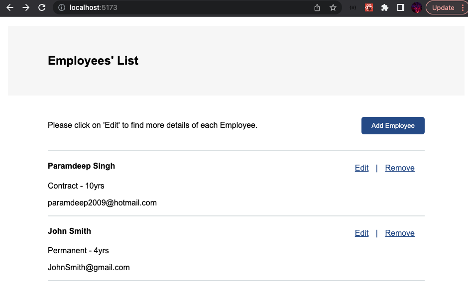

# NSW DCP Employee List Full-Stack Project

# Landing Page



# Required Software/Tech

1. MySQLWorkbench
2. Eclipse or other preferd program with ability to import Maven projects
3. Browser (Chrome or any V8 engine is preferred)
4. Node (Version 19+)
5. NPM

# Description of project

## Database

- SQL was used for the database as it allowed for easy integration with Spring through the Spring JPA.

## Backend

- The backend was built using java. Java was chosen as the primary programming language for the back-end of the application because of its robustness and platform independence,

- Spring was used as the primary framework for building the back-end of the application because of its extensive set of features, including dependency injection, aspect-oriented programming, and support for various database technologies.

- The Spring JPA repository was responsible for performing CRUD operations on the Employee entity. This was achieved using various methods provided by Spring JPA, such as `save()`, `findById()`, `findAll()`, and `deleteById()`

- In spring, decorators and annotations such as `Autowired` were used to manage the lifecycle of objects.

- Spring Validation decorators were also used to ensure data in the `EmployeeDTO` to conduct input validations on the backend.

- Fields were made private and accessed by getters and setters for additional data security during use and development.

## FrontEnd

- React TypeScript was used to build the frontend. TypeScript is a great alternative to JavaScript as it allows for strict typing, making it robust for commercial use.

- The application was generated by Vite, a lightweight alternative to Create-React-app.

- React router was used for the navigation throughout the app.

- RESTFul API endpoint were hit using using Axios.

- The react-query library was used to make calls clean and efficient in the background. It also allows for state providers, making sharing data and state across components easy.

- For the form React Hook Form was used to manage the data, which was typed to an interface. It also allowed for easy validations for user inputs.

- Testing the frontend was achieved by Vitest, React testing library and axios.

- Styling was completed inline with the spec document, through SCSS and the BEM naming convention for classes which makes for more readable, maintainable styling. This is also achieved through mixins and partials, which are a great benefit over traditional CSS.

# Setup and running locally

To Run the Application a few Prerequisites are required.

- Firstly clone this repo to your machine using `git clone `

## Backend and Database

- You can import the backend into a Java IDE of your choice, by importing the backend as a Maven project and running.
- It should be noted that you will need to add the below configuration into your `application.properties` and ensure your database is set up.

- In order for the creation, deletion, update and reading of data from the database, MySQL workbench is required.
  > 1.  MySQL Workbench with a connection under the name `employeeList`
- Once the above connection has been started you may need to configure your Spring `application.properties` to contain the following :

```java
spring.datasource.url=jdbc:mysql://localhost:3306/employeelist
spring.datasource.username=root
spring.datasource.password= <YOUR MYSQL PASSWORD HERE>
spring.jpa.hibernate.ddl-auto=update
spring.jpa.properties.hibernate.dialect=org.hibernate.dialect.MySQL5InnoDBDialectspring.jpa.generate-ddl=true
```

- In your MySQLWorkbench you can run the following to see your connection:

```sql
CREATE DATABASE employeelist;

USE employeelist;

SHOW TABLES;

SELECT * FROM employee;

```

- You should now be able to run the backend and database !

## Frontend

- `cd frontend/employeeList` and run `npm install` to install all dependencies required for the front-end.

- You can run the frontend by using `npm run dev`

- The project will then run on vites default port of :5137 using `localhost:5173` in your browser.

- The Backend, Database and Frontend are now running !

## Reflection

- Overall this tech test exposed me to many new technologies and it was overall satisfying to piece many different technologies together to create a seamless product. It is what i enjoy doing.

- Most of the challenges i faced were surrounding testing. I had implemented many new libraries such as react hook form and useQuery.
- Mocking API calls is also something i did not have much exposure to prior to this project.

- Through implementing, reading documentation i was able to learn a lot of new things, while also honing in on my existing skillset.

- I found both frontend and backend to be fun, as both bring forth their own challenges.

## Future Goals

- Add more refined validations
- More robust error handling
- More detailed testing for both front and backend.

## Further reading or links to inspiration

- [React Hook Form](https://react-hook-form.com/get-started)

- [React Query](https://tanstack.com/query/v4/docs/react/overview)

- [Spring Logging](https://www.baeldung.com/spring-boot-logging)

- [Handling CORS](https://www.baeldung.com/spring-cors)

- [React Router](https://reactrouter.com/en/main/start/tutorial)

- [React Router](https://reactrouter.com/en/main/start/tutorial)

### Stay in touch

- [LinkedIn](https://www.linkedin.com/in/paramsinghau/)
- [Github ](https://github.com/paramSingh1)

### Licence

[](https://choosealicense.com/licenses/mit/)
